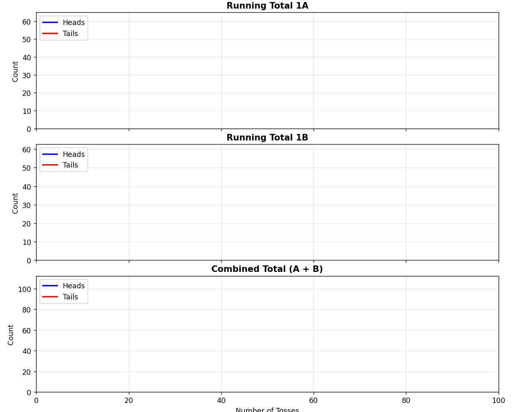
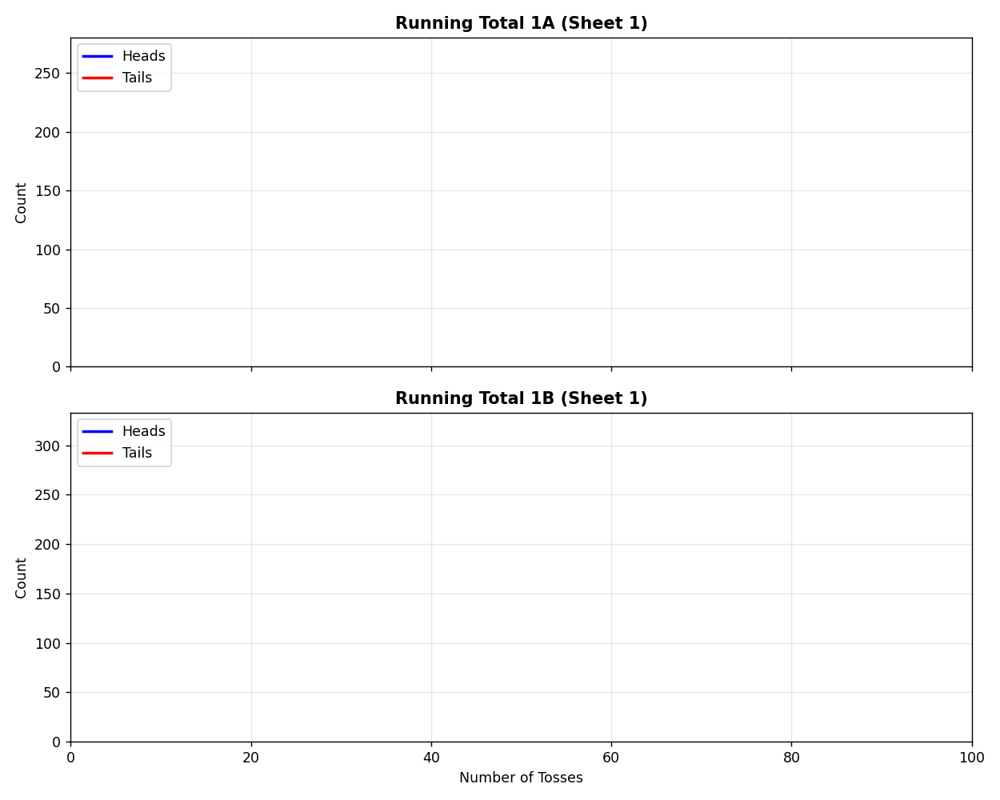
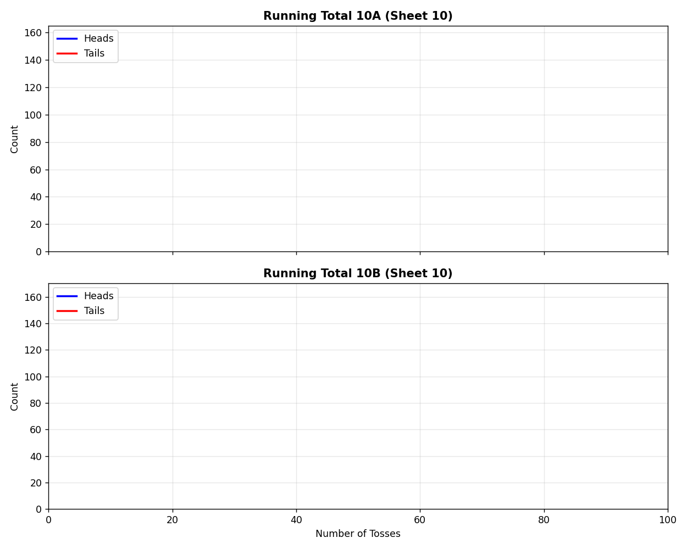
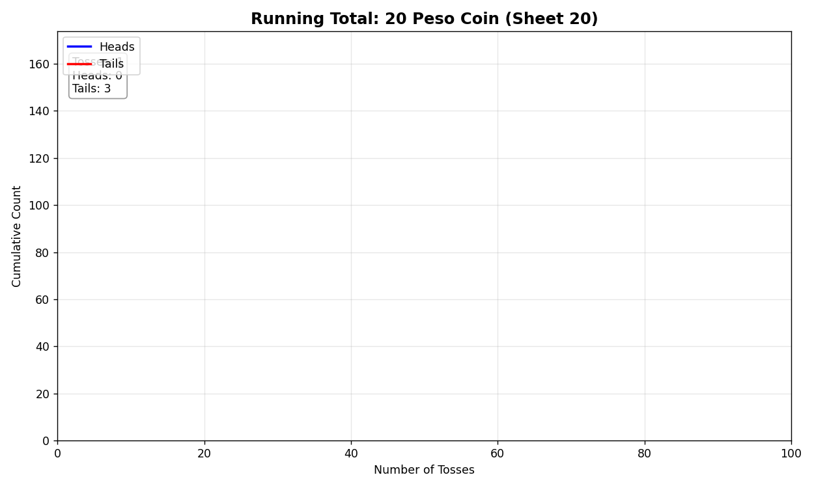
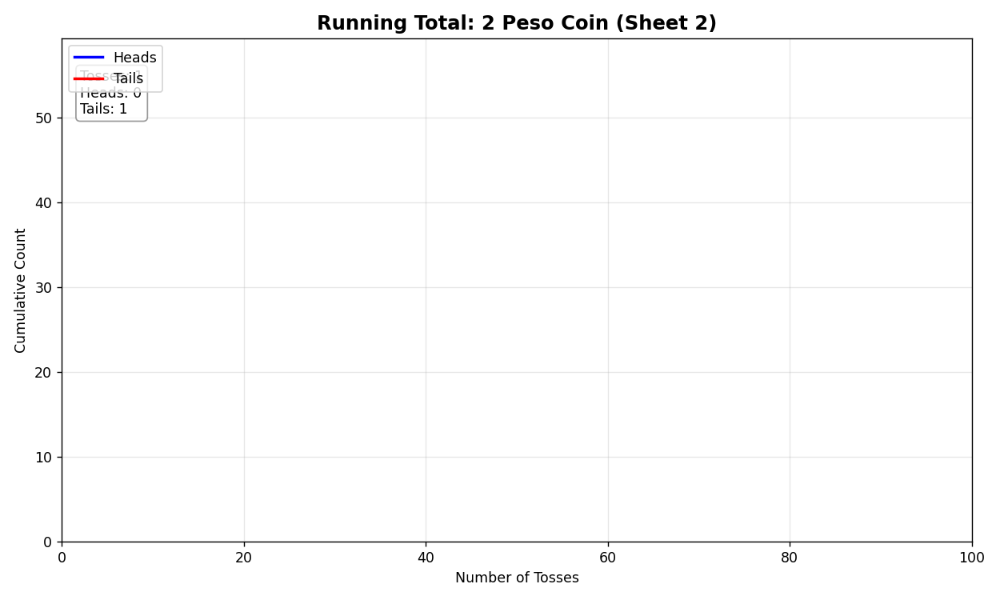
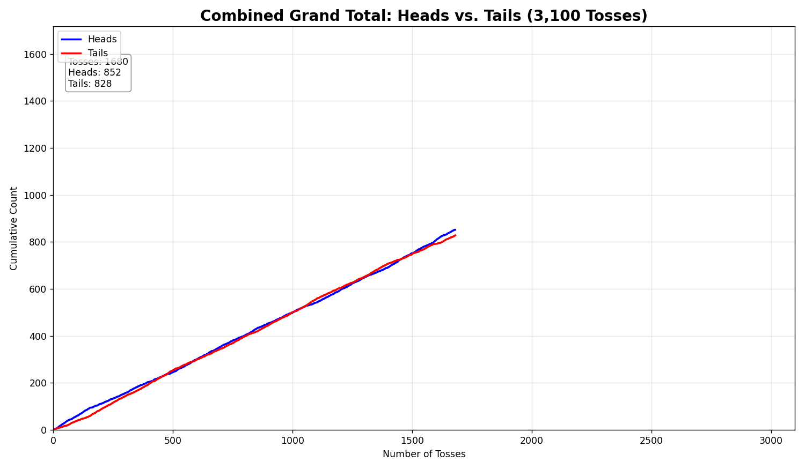
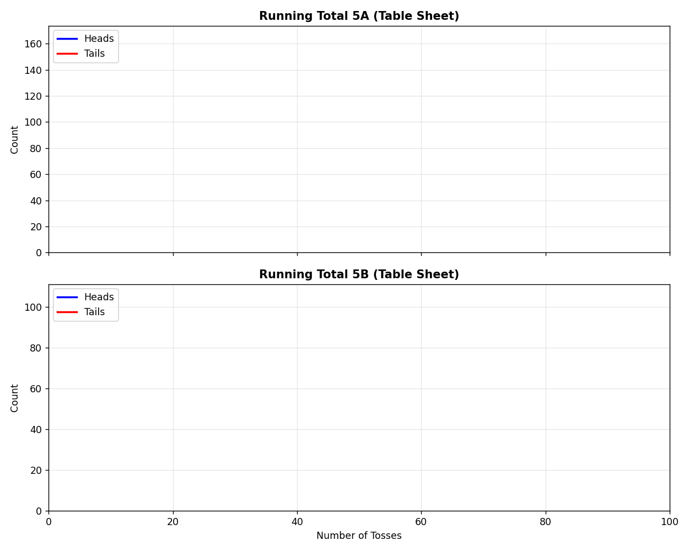
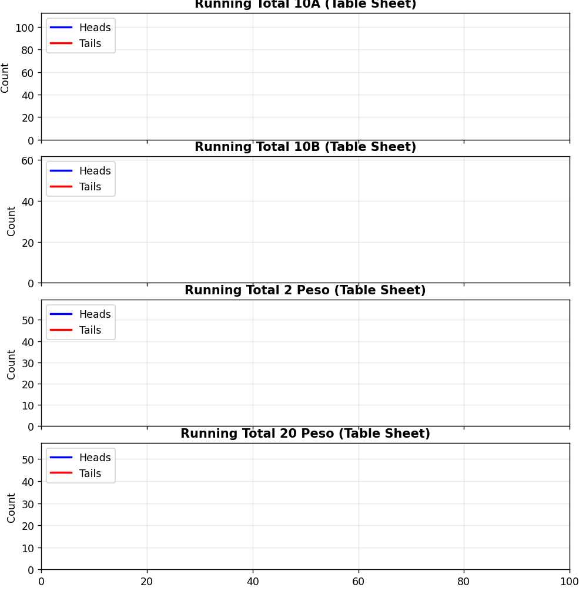
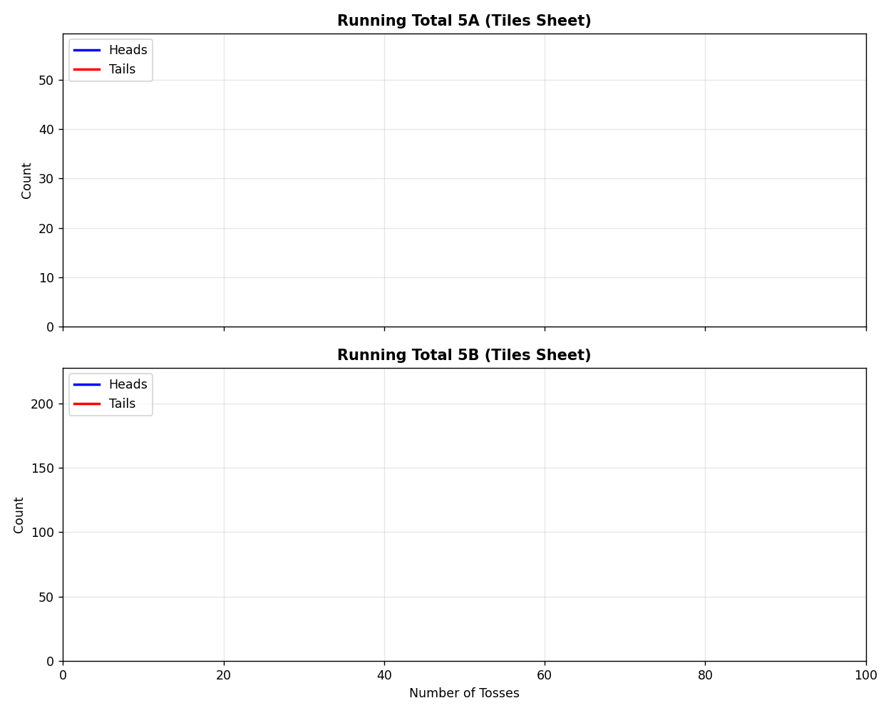
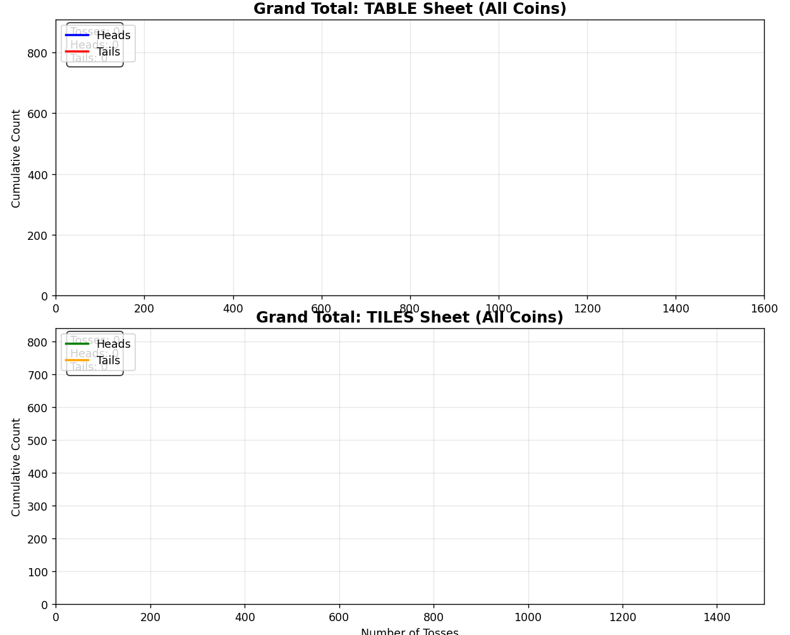

# Statistical Analysis of Coin Toss Data

## Overview
This project performs a comprehensive statistical analysis of coin toss data to observe the **Law of Large Numbers**. Using Python and Pandas, raw data from multiple Excel sheets ("Group", "Table", "Tiles", and individual denominations) was processed to visualize the convergence of probability over thousands of trials.

The analysis is divided into **six distinct tasks**, each focusing on a different segment of the dataset.

---

## Group Members
1. Felix Joseph Dinopol
2. Christian Jay Lucanas
3. Jhon Kierve Gardonia

---

## Task 1-2: Group H & T (Coin Class & Combine)
**Objective:** Analyze the initial "Group" dataset, separating the running totals for Group 1A and Group 1B to observe early trends.

### Visualizations

  
  
<em>Figure 1: Running totals for Group 1A, 1B, and Combined.</em>

**Key Findings:**
* The separation of Group A and Group B reveals distinct trajectories in the early trials.
* [Add any specific observation here, e.g., "Group A had a streak of heads early on..."]

---

## Task 3: All H & T (Coin Class)
**Objective:** Visualize the running totals for specific coin values (1 Peso, 2 Peso, 5 Peso, 10 Peso, 20 Peso) to check for consistency across different denominations.

### 1 Peso & 5 Peso (A vs B)

  
  

### 10 Peso & 20 Peso

  
  

### 2 Peso (Single Running Total)

  

---

## Task 4: All H & T (Combine)
**Objective:** Combine all available raw data into a single sequence of 3,100 tosses to verify the Law of Large Numbers on a macro scale.

### Visualization

  
  
<em>Figure 3: Cumulative race between Heads and Tails over 3,100 trials.</em>

**Analysis:**
* As the number of trials ($n$) increases to 3,100, the proportion of heads and tails stabilizes.
* The graph demonstrates the "race" effectively narrowing as the sample size grows.

---

## Task 5: Canvass H & T (Coin Class)
**Objective:** To verify data integrity by visualizing the running totals from the "Table" and "Tiles" sheets separately, ensuring that different recording formats did not interfere with the statistical outcome.

### Table
### 1 Peso & 5 Peso (A vs B)

  
  

### 10 Peso, 20 Peso and 2 Peso

  

---

### Tiles
### 1 Peso & 5 Peso (A vs B)

  
  

### 10 Peso & 20 Peso

  

### 2 Peso (Single Running Total)

  

**Observations:**
* Both sheets exhibit a strong convergence toward a 50/50 distribution. While individual coin types show minor local variances (streaks), the aggregate data in both recording formats mirrors the theoretical probability expected in large-scale trials.

---

## Task 6: Canvass H & T (Combine)
**Objective:** Generate a "Grand Total" graph specifically for the **Table Sheet** and the **Tiles Sheet** to compare the aggregate data quality and trends between the two recording methods.

### Table vs. Tiles Aggregate

  
  
<em>Figure 6: Top graph shows Table Sheet Total; Bottom graph shows Tiles Sheet Total.</em>

**Observations:**
* The final grand totals from both sheets serve as the definitive proof for this experiment, showing that as $n$ increases, the results consistently approach the expected 50/50 probability.

**Conclusion:**
* Both datasets exhibit the expected statistical behavior.
* The final comparison confirms the integrity of the data across different sheets.

---

## Technologies Used
* **Python** (Data Processing)
* **Pandas** (Data Extraction & Cleaning)
* **Matplotlib** (Static & Animated Visualization)